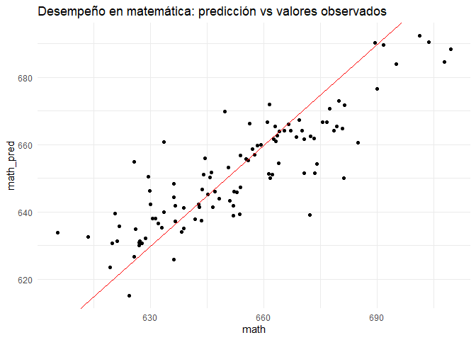

R & python: Lo mejor de ambos mundos
================
Karina Bartolomé
2022-04-06

``` r
knitr::opts_chunk$set(echo = TRUE, 
                      message = FALSE, 
                      warning = FALSE)
```

# Librerías y configuraciones

``` r
#install.packages('tidyverse')
#install.packages('AER')
```

``` r
library(tidyverse)
library(AER)
library(reticulate)

reticulate::use_condaenv(condaenv = 'rladies', 
                         required = TRUE)
```

``` python
import numpy as np
import pandas as pd

from sklearn.model_selection import train_test_split
from sklearn.pipeline import Pipeline
from sklearn.impute import SimpleImputer
from sklearn.preprocessing import StandardScaler
from sklearn.ensemble import RandomForestRegressor
```

# Datos

``` r
data(CASchools)
```

``` r
cat(params$descripcion)
```

Modelo considerando lunch, income y cawork

# Transformaciones

En cambio, en un chunk python se utiliza {reticulate} para acceder al
objeto params (R). Este objeto en R pasa a ser un diccionario, con lo
cual se accede a los valores de cada clave mediante el método .get():

``` python
print('El objeto params es un', type(r.params))
```

    ## El objeto params es un <class 'dict'>

``` python
df = (r.CASchools 
    
    [['math',r.params.get('var1'), r.params.get('var2'), r.params.get('var3')]]

    .copy()
)
```

# Modelo

``` python
X = df.drop('math',axis=1).copy()
y = df['math']

X_train, X_test, y_train, y_test = train_test_split(X, y, test_size=0.25, random_state=42)

pipe = Pipeline([
  ('imputador',      SimpleImputer(strategy='constant', fill_value= 0)),
  ('scaler',         StandardScaler()), 
  ('random_forest',  RandomForestRegressor(n_estimators=100, random_state=42))
])
  
pipe.fit(X_train, y_train)
```

    ## Pipeline(steps=[('imputador', SimpleImputer(fill_value=0, strategy='constant')),
    ##                 ('scaler', StandardScaler()),
    ##                 ('random_forest', RandomForestRegressor(random_state=42))])

``` python
modelo = pipe['random_forest']
```

# Inferencias

``` python
preds_test = pd.DataFrame(
    {
    'math':y_test, 
    'math_pred':pipe.predict(X_test)
    }
)
```

# Evaluación

``` r
py$preds_test %>% 
  ggplot(aes(x=math, y=math_pred))+
  geom_point()+
  geom_abline(intercept=0, slope=1, color='red')+
  labs(title = "Desempeño en matemática: predicción vs valores observados")+
  theme_minimal()
```

<!-- -->

# SessionInfo

``` r
sessioninfo::package_info() %>% 
  dplyr::filter(attached==TRUE) %>% 
  dplyr::select(package, loadedversion, date, source) %>% 
  gt::gt() %>% as.data.frame()
```

    ##       package loadedversion       date         source
    ## 1         AER         1.2-9 2020-02-06 CRAN (R 4.1.3)
    ## 2         car        3.0-11 2021-06-27 CRAN (R 4.1.0)
    ## 3     carData         3.0-4 2020-05-22 CRAN (R 4.1.0)
    ## 4       dplyr         1.0.7 2021-06-18 CRAN (R 4.1.0)
    ## 5     forcats         0.5.1 2021-01-27 CRAN (R 4.1.0)
    ## 6     ggplot2         3.3.5 2021-06-25 CRAN (R 4.1.0)
    ## 7      lmtest        0.9-38 2020-09-09 CRAN (R 4.1.0)
    ## 8       purrr         0.3.4 2020-04-17 CRAN (R 4.1.0)
    ## 9       readr         1.4.0 2020-10-05 CRAN (R 4.1.0)
    ## 10 reticulate          1.20 2021-05-03 CRAN (R 4.1.0)
    ## 11   sandwich         3.0-1 2021-05-18 CRAN (R 4.1.3)
    ## 12    stringr         1.4.0 2019-02-10 CRAN (R 4.1.0)
    ## 13   survival        3.2-11 2021-04-26 CRAN (R 4.1.0)
    ## 14     tibble         3.1.2 2021-05-16 CRAN (R 4.1.0)
    ## 15      tidyr         1.1.3 2021-03-03 CRAN (R 4.1.0)
    ## 16  tidyverse         1.3.1 2021-04-15 CRAN (R 4.1.0)
    ## 17        zoo         1.8-9 2021-03-09 CRAN (R 4.1.0)
