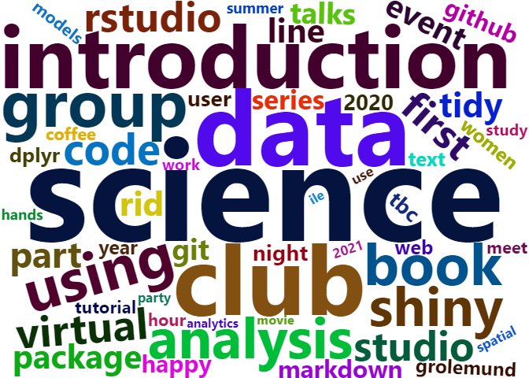
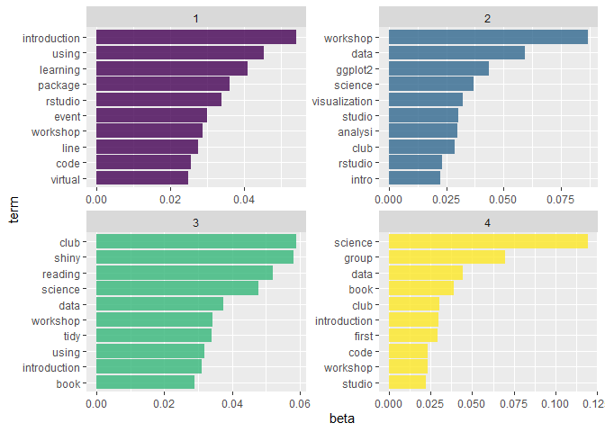

Topic modeling
================
RLadies BA
2023-06-20

``` r
# install.packages("remotes")
# remotes::install_github("rladies/meetupr")

library(meetupr)
library(tidyverse)
library(gt)
library(jsonlite)
library(wordcloud2) 
library(textrecipes)
library(topicmodels)
library(stringi)
library(httr)
```

Se buscan todos los capítulos de RLadies, considerando la tabla
disponible en el blog de RLadies Global:

``` r
path <- 'https://raw.githubusercontent.com/rladies/rladies.github.io/main/data/meetup/chapters.json'
df <- as.data.frame(fromJSON(path))
```

El paquete {meetupr} 📦 permite acceder a la API de Meetup de forma
sencilla. Por ejemplo, se utiliza la función get_events() para obtener
un dataframe de los eventos del capítulo de RLadies-BA:

``` r
urlname <- "rladies-buenos-aires"
df_events_ba <- get_events(urlname) %>% 
  arrange(desc(time))

df_events_ba %>% 
 glimpse()
```

    ## Rows: 38
    ## Columns: 18
    ## $ id            <chr> "289768539", "285697216", "284393282", "281818129", "280…
    ## $ title         <chr> "Creando tablas en {gt} con Spotify API & Bad Bunny", "G…
    ## $ link          <chr> "https://www.meetup.com/rladies-buenos-aires/events/2897…
    ## $ status        <chr> "PAST", "PAST", "PAST", "PAST", "PAST", "PAST", "PAST", …
    ## $ duration      <chr> "PT2H", "PT2H", "PT2H", "PT2H", "PT2H", "PT2H", "PT2H", …
    ## $ going         <int> 47, 22, 15, 40, 110, 61, 96, 48, 86, 95, 141, 50, 99, 11…
    ## $ waiting       <int> 0, 0, 0, 30, 0, 0, 0, 0, 0, 0, 0, 0, 0, 0, 0, 0, 0, 0, 0…
    ## $ description   <chr> "**¡Se viene un nuevo Meetup organizado por R-Ladies Bue…
    ## $ venue_id      <chr> "26906060", "26906060", "26390445", "26906060", "2690606…
    ## $ venue_lat     <dbl> -8.521147, -8.521147, -34.606500, -8.521147, -8.521147, …
    ## $ venue_lon     <dbl> 179.19620, 179.19620, -58.43563, 179.19620, 179.19620, 1…
    ## $ venue_name    <chr> "Online event", "Online event", "Parque Centenario", "On…
    ## $ venue_address <chr> "", "", "Av. Díaz Vélez", "", "", "", "", "", "", "", ""…
    ## $ venue_city    <chr> "", "", "CABA", "", "", "", "", "", "", "", "", "", "", …
    ## $ venue_state   <chr> "", "", "Ca", "", "", "", "", "", "", "", "", "", "", ""…
    ## $ venue_zip     <chr> "", "", "C1414", "", "", "", "", "", "", "", "", "", "",…
    ## $ venue_country <chr> "", "", "Argentina", "", "", "", "", "", "", "", "", "",…
    ## $ time          <dttm> 2022-11-23 18:30:03, 2022-05-11 18:00:03, 2022-03-12 16…

Para cada uno de los capítulos del df de capítulos, se busca la
información de cada uno de los eventos:

``` r
# df_events = data.frame()
# for (i in df %>% pull(urlname)){
#   print(i)
#   df_temp = get_events(i)
#   if (!is.null(df_temp)){
#     df_events = df_events %>% 
#       bind_rows(df_temp %>% mutate(urlname=i))
#   }
# }
# 
```

Traducción de textos a inglés:

``` r
# url <- 'https://apertium.org/apy/translate'
# 
# traductor <- function(x){
#   params <- list(
#     langpair = 'spa|eng',
#     markUnknown = 'no',
#     prefs = '',
#     q = x
#   )
#   response <- GET(url, query = params)
#   
#   if (status_code(response) == 200) {
#     x_translated <- content(response, "parsed")
#   }
#   
#   x_translated = x_translated[["responseData"]][["translatedText"]]
#   
#   return(x_translated)
# }
# 
# df_events <- df_events %>% 
#   mutate(title_english = map(title, ~traductor(.), .progress=TRUE))
```

``` r
# df_events %>% write_rds('df_events.rds')

df_events <- read_rds('df_events.rds') %>% 
  mutate(text = paste(unlist(title_english)))
```

``` r
set.seed(1234)
df_events %>% 
  select(title, title_english) %>% 
  sample_n(10)
```

    ##                                                                     title
    ## 1                                                  Getting Started with R
    ## 2    Estadística descriptiva con R: gráficas, tablas y medidas de resumen
    ## 3  R-Ladies Gainesville monthly meeting: Dr Auriel Fournier talks #rtweet
    ## 4                          Visualizando datos: especial #30díasdegráficos
    ## 5                            🔧Tutorial de manipulación de datos con dplyr
    ## 6                                       4-Week Introduction to R Workshop
    ## 7              Movie night: Star Wars Episode V – The Empire Strikes Back
    ## 8   Meetup R-Ladies São Paulo - Oficina de Introdução ao R e ao Tidyverse
    ## 9                                    Data visualization in R with ggplot2
    ## 10                                  Building Interactive Plots with Shiny
    ##                                                              title_english
    ## 1                                                   Getting Started with R
    ## 2  Descriptive statistics with R: graphic, tables and measures of round-up
    ## 3   R-Ladies Gainesville monthly meeting: Dr Auriel Fournier talks #rtweet
    ## 4                              Visualising data: special #30díasdegráficos
    ## 5                             🔧Tutorial Of manipulation of data with dplyr
    ## 6                                        4-Week Introduction to R Workshop
    ## 7               Movie night: Star Wars Episode V – The Empire Strikes Back
    ## 8   Meetup R-Ladies São Paulo - Office of Introdução ao R and ao Tidyverse
    ## 9                                 It dates visualization in R with ggplot2
    ## 10                                   Building Interactive Plots with Shiny

# Análisis exploratorio

``` r
df_events %>% 
  skimr::skim()
```

|                                                  |            |
|:-------------------------------------------------|:-----------|
| Name                                             | Piped data |
| Number of rows                                   | 4289       |
| Number of columns                                | 21         |
| \_\_\_\_\_\_\_\_\_\_\_\_\_\_\_\_\_\_\_\_\_\_\_   |            |
| Column type frequency:                           |            |
| character                                        | 15         |
| list                                             | 1          |
| numeric                                          | 4          |
| POSIXct                                          | 1          |
| \_\_\_\_\_\_\_\_\_\_\_\_\_\_\_\_\_\_\_\_\_\_\_\_ |            |
| Group variables                                  | None       |

Data summary

**Variable type: character**

| skim_variable | n_missing | complete_rate | min |  max | empty | n_unique | whitespace |
|:--------------|----------:|--------------:|----:|-----:|------:|---------:|-----------:|
| id            |         0 |          1.00 |   8 |   13 |     0 |     4241 |          0 |
| title         |         0 |          1.00 |   3 |   80 |     0 |     3560 |          0 |
| link          |         0 |          1.00 |  50 |   70 |     0 |     4241 |          0 |
| status        |         0 |          1.00 |   4 |    9 |     0 |        2 |          0 |
| duration      |         0 |          1.00 |   4 |    9 |     0 |       69 |          0 |
| description   |         0 |          1.00 |   0 | 4509 |    50 |     3805 |          0 |
| venue_id      |       186 |          0.96 |   6 |    8 |     0 |     1132 |          0 |
| venue_name    |       186 |          0.96 |   2 |  101 |     0 |     1087 |          0 |
| venue_address |       186 |          0.96 |   0 |  165 |  1875 |     1053 |          0 |
| venue_city    |       186 |          0.96 |   0 |   32 |  1824 |      283 |          0 |
| venue_state   |       186 |          0.96 |   0 |    2 |  2569 |      116 |          0 |
| venue_zip     |       186 |          0.96 |   0 |    9 |  2715 |      475 |          0 |
| venue_country |         0 |          1.00 |   0 |   14 |  2010 |       48 |          0 |
| urlname       |         0 |          1.00 |  10 |   30 |     0 |      202 |          0 |
| text          |         0 |          1.00 |   3 |   86 |     0 |     3531 |          0 |

**Variable type: list**

| skim_variable | n_missing | complete_rate | n_unique | min_length | max_length |
|:--------------|----------:|--------------:|---------:|-----------:|-----------:|
| title_english |         0 |             1 |     3531 |          1 |          1 |

**Variable type: numeric**

| skim_variable | n_missing | complete_rate |  mean |     sd |      p0 |    p25 |   p50 |    p75 |  p100 | hist  |
|:--------------|----------:|--------------:|------:|-------:|--------:|-------:|------:|-------:|------:|:------|
| going         |         0 |          1.00 | 30.15 |  30.73 |    0.00 |   9.00 | 21.00 |  41.00 | 333.0 | ▇▁▁▁▁ |
| waiting       |         0 |          1.00 |  1.20 |  12.93 |    0.00 |   0.00 |  0.00 |   0.00 | 628.0 | ▇▁▁▁▁ |
| venue_lat     |       186 |          0.96 | 13.12 |  28.50 |  -54.80 |  -8.52 |  0.00 |  40.74 |  60.4 | ▂▁▇▂▇ |
| venue_lon     |       186 |          0.96 | 44.64 | 118.50 | -123.26 | -77.03 | 13.41 | 179.20 | 179.2 | ▆▁▃▁▇ |

**Variable type: POSIXct**

| skim_variable | n_missing | complete_rate | min                 | max                 | median              | n_unique |
|:--------------|----------:|--------------:|:--------------------|:--------------------|:--------------------|---------:|
| time          |         0 |             1 | 2012-10-31 18:00:07 | 2024-06-06 18:00:03 | 2020-03-17 12:15:05 |     3771 |

# Preprocesamiento

Al estar trabajando con datos de texto, es necesario realizar una serie
de pasos de limpieza de texto. Para ello, una alternativa es utilizar
{textrecipes} 📦, una extensiòn de {tidymodels} 📦 que incluye
diferentes pasos de preprocesamiento de texto.

``` r
custom_stopwords <- c(
  tm::stopwords("spanish"),
  'lunchinators', 'guayaquil', 'hola', 'rladies', 'ladies', 'date', 'dates', 'meetup','meeting','session')

n_char_filter <- function(x) {
  nchar(x) > 2
}
```

``` r
preproc <- recipe( ~ text,
                   data = df_events) %>%
  step_mutate(text = stri_trans_general(text, id = "Latin-ASCII")) %>%
  step_text_normalization(text) %>%
  step_tokenize(text) %>%
  step_stopwords(text) %>%
  step_stopwords(text, language = 'es',
                 custom_stopword_source = custom_stopwords) %>%
  step_tokenfilter(
    text,
    max_times = 0.9,
    min_times = 0.001,
    percentage=TRUE,
  ) %>% 
  step_tokenfilter(text, filter_fun=n_char_filter)
```

``` r
preproc %>% 
  step_tf(text) %>% 
  prep() %>% 
  juice() %>% 
  ncol()
```

    ## [1] 93

Se procesan los datos con el preprocesador y se visualizan las
principales palabras (o N grams) en una nube de palabras:

``` r
preproc_fitted <- preproc %>% 
  prep()

preproc_fitted %>% juice() %>% head()
```

    ## # A tibble: 6 × 1
    ##         text
    ##    <tknlist>
    ## 1 [3 tokens]
    ## 2 [0 tokens]
    ## 3 [0 tokens]
    ## 4 [1 tokens]
    ## 5 [0 tokens]
    ## 6 [0 tokens]

Prueba del procesador con datos nuevos:

``` r
preproc_fitted %>% 
  bake(new_data = data.frame(
    text=c('rmarkdown documents in r with ggplot2 introduction introductory class viz meet',
           'Rmarkdown y rstudio rladies',
           "Let's meet for the first time",
           "Rmarkdown!!") 
  )) %>% 
  mutate(text = textrecipes:::get_tokens(text)) %>% 
  mutate(text = sapply(text, paste, collapse = " "))
```

    ## # A tibble: 4 × 1
    ##   text                               
    ##   <chr>                              
    ## 1 rmarkdown ggplot2 introduction meet
    ## 2 rmarkdown rstudio                  
    ## 3 meet first time                    
    ## 4 rmarkdown

Nube de palabras:

``` r
preproc %>% 
  step_untokenize(text) %>% 
  prep() %>% 
  juice() %>% 
  mutate(text = as.character(text)) %>% 
  tidytext::unnest_tokens(word, text) %>% 
  group_by(word) %>% 
  count(word, sort=TRUE) %>% 
  filter(word!='') %>% 
  wordcloud2()
```

<!-- -->

# Modelo LDA: Latent dirichlet analysis

``` r
lda_tokenizer <- function(x) text2vec::word_tokenizer(tolower(x))

lda_model <- preproc %>% 
  step_lda(all_predictors(), num_topics = 3, id='lda') 

lda_model_fit <- lda_model %>% 
  prep() 

lda_topics <- lda_model %>% tidy(id='lda', matrix='beta')

summary(lda_model_fit)
```

    ## # A tibble: 3 × 4
    ##   variable   type      role      source 
    ##   <chr>      <list>    <chr>     <chr>  
    ## 1 lda_text_1 <chr [2]> predictor derived
    ## 2 lda_text_2 <chr [2]> predictor derived
    ## 3 lda_text_3 <chr [2]> predictor derived

# LDA con topicmodel

<https://juliasilge.github.io/tidytext/articles/topic_modeling.html>

``` r
remove_s <- function(x) gsub("s$", "", x)

preproc <- recipe( ~ text,
                   data = df_events) %>%
  step_mutate(text = stri_trans_general(text, id = "Latin-ASCII")) %>%
  step_text_normalization(text) %>%
  step_tokenize(text) %>%
  step_stopwords(text) %>%
  step_stopwords(text, language = 'es',
                 custom_stopword_source = custom_stopwords) %>%
  #step_untokenize(text) %>% 
  #step_tokenize(text, engine='spacyr') %>% 
  step_stem(text, custom_stemmer = remove_s) %>% 
  step_tokenfilter(
    text,
    max_times = 0.2,
    min_times = 0.001,
    percentage=TRUE,
  ) %>% 
  step_tokenfilter(text, filter_fun=n_char_filter)
```

``` r
preproc %>% 
  step_tf(text) %>% 
  prep() %>% 
  juice() %>% 
  ncol()
```

    ## [1] 94

``` r
data_preproc <- preproc %>% 
  step_tf(text) %>% 
  prep() %>% 
  juice() %>% 
  filter(if_any(everything(.), ~. != 0))

# alpha represents document-topic density and Beta represents topic-word density. 
# Higher the value of alpha, documents are composed of more topics and lower the value of alpha, documents contain fewer topics.
lda_model_2 <- topicmodels::LDA(
  data_preproc, k = 4, 
  control = list(seed = 42)
  )

lda_model_2
```

    ## A LDA_VEM topic model with 4 topics.

``` r
lda_td <- tidytext::tidy(lda_model_2, matrix='beta')
```

``` r
top_terms <- lda_td %>%
  group_by(topic) %>%
  top_n(10, beta) %>%
  ungroup() %>%
  arrange(topic, -beta)
```

``` r
top_terms %>%
  mutate(
    term = str_replace(term, 'tf_text_','') 
  ) %>% 
  mutate(
    topic = factor(topic),
    term = tidytext::reorder_within(term, beta, topic)
  ) %>%
  ggplot(aes(term, beta, fill = topic)) +
  geom_bar(alpha = 0.8, stat = "identity", show.legend = FALSE) +
  tidytext::scale_x_reordered() +
  facet_wrap(facets = vars(topic), scales = "free", ncol = 2) +
  coord_flip()+
  scale_fill_viridis_d()
```

<!-- -->

``` r
top_terms %>%
  mutate(topic = paste0("topic", topic)) %>%
  pivot_wider(names_from = topic, values_from = beta) %>% 
  filter(topic1 > .001 | topic2 > .001) %>%
  mutate(log_ratio = log2(topic2 / topic1))
```

    ## # A tibble: 18 × 6
    ##    term                   topic1  topic2  topic3  topic4 log_ratio
    ##    <chr>                   <dbl>   <dbl>   <dbl>   <dbl>     <dbl>
    ##  1 tf_text_introduction   0.0540 NA       0.0311  0.0298    NA    
    ##  2 tf_text_using          0.0454 NA       0.0319 NA         NA    
    ##  3 tf_text_learning       0.0410 NA      NA      NA         NA    
    ##  4 tf_text_package        0.0361 NA      NA      NA         NA    
    ##  5 tf_text_rstudio        0.0339  0.0232 NA      NA         -0.551
    ##  6 tf_text_event          0.0300 NA      NA      NA         NA    
    ##  7 tf_text_workshop       0.0287  0.0867  0.0343  0.0236     1.59 
    ##  8 tf_text_line           0.0275 NA      NA      NA         NA    
    ##  9 tf_text_code           0.0256 NA      NA       0.0237    NA    
    ## 10 tf_text_virtual        0.0250 NA      NA      NA         NA    
    ## 11 tf_text_data          NA       0.0591  0.0374  0.0443    NA    
    ## 12 tf_text_ggplot2       NA       0.0435 NA      NA         NA    
    ## 13 tf_text_science       NA       0.0369  0.0479  0.119     NA    
    ## 14 tf_text_visualization NA       0.0321 NA      NA         NA    
    ## 15 tf_text_studio        NA       0.0303 NA       0.0224    NA    
    ## 16 tf_text_analysi       NA       0.0299 NA      NA         NA    
    ## 17 tf_text_club          NA       0.0288  0.0589  0.0303    NA    
    ## 18 tf_text_intro         NA       0.0225 NA      NA         NA

# Para LDAViz (no funciona aún)
