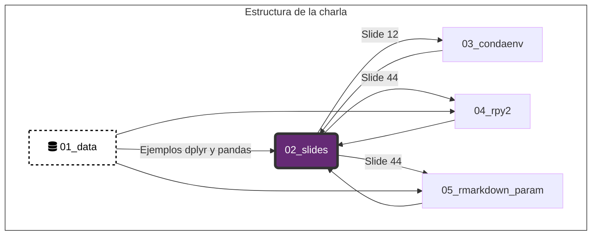

# 💜 Charlas RLadies 💜 

## **1. 01_r_python/** 👉 [El uso de R y python](https://karbartolome.github.io/rladies_charlas/01_r_python/02_slides/rladies_r_python.html)

Se presenta la configuración necesaria para utilizar python en Rstudio / Rmarkdown, combinando R y python en un único archivo. 

Incluye diferencias entre {tidyverse} y {pandas}, uso de {reticulate}, {rpy2}, modelos de regresión lineal en R y python. 

